# 🎓 Cranes Digital Academy (CDA) — Career Companion Mobile Platform

<p align="center">
  
</p>

<p align="center">
  <strong>Production-Grade AI Interviewing, Real-Time Skill Assessment & Placement Preparation Platform</strong>
</p>

<p align="center">
  
  
  
  
  
</p>

---

## 📑 Table of Contents

1. [Executive Summary & Purpose](#-executive-summary--purpose)
2. [System Architecture & Data Flow Diagram (DFD)](#-system-architecture--data-flow-diagram-dfd)
3. [Architecture & Component Overview](#-architecture--component-overview)
4. [Key Features & Business Logic Implemented](#-key-features--business-logic-implemented)
   - [A. High-Speed AI Technical Interview System](#a-high-speed-ai-technical-interview-system)
   - [B. Standardized 4-Tier Rubric Matrix](#b-standardized-4-tier-rubric-matrix)
   - [C. Universal Dynamic Card Architecture](#c-universal-dynamic-card-architecture)
   - [D. Real-Time Study Tracking (Strictly No XP Fluff)](#d-real-time-study-tracking-strictly-no-xp-fluff)
   - [E. Enterprise Authentication & Pre-Verified OTP Recovery](#e-enterprise-authentication--pre-verified-otp-recovery)
   - [F. Job Board, Short Video Reels & Cloud Resumes](#f-job-board-short-video-reels--cloud-resumes)
   - [G. Data Governance, Storage Pruner & GDPR Data Export](#g-data-governance-storage-pruner--gdpr-data-export)
5. [Database Tables Status (Supabase PostgreSQL)](#-database-tables-status-supabase-postgresql)
6. [Repository Structure](#-repository-structure)
7. [Environment Variables & Configuration](#-environment-variables--configuration)
8. [Getting Started & Build Instructions](#-getting-started--build-instructions)
9. [CDA Engineering Team & Contributors](#-cda-engineering-team--contributors)

---

## 📖 Executive Summary & Purpose

**Cranes Digital Academy (CDA)** is an enterprise mobile platform engineered for engineering students and placement candidates specializing in **Embedded Systems & IoT, Java Cloud Fullstack, VLSI Design, Automotive AUTOSAR, and Python AI/Data Science**.

The platform provides a **100% direct client-to-cloud AI interview simulator** operating with sub-second response latency (<1.2s), real-time speech synthesis/recognition, live Supabase-persisted job descriptions and evaluation rubrics, study time synchronization, and secure account recovery.

---

## 🏗️ System Architecture & Data Flow Diagram (DFD)

```mermaid
flowchart TD
    subgraph Client ["📱 Flutter Mobile Client (Release v2.9.5+34)"]
        UI["UI Layer / Riverpod State Management"]
        TTS["Neural Voice Synthesis & Speech-to-Text"]
        Tracker["StudyTimeTracker Foreground Service"]
        UniversalCard["_buildUniversalOptionCard Dynamic Architecture"]
    end

    subgraph LLM_Engine ["⚡ High-Speed AI Inference (<1.2s Latency)"]
        Groq["Groq Cloud API (Llama-3.3 70B / GPT-OSS 120B / Qwen 27B)"]
    end

    subgraph Database_Layer ["🗄️ Supabase Cloud (PostgreSQL 15 + RLS)"]
        AuthDB["Supabase Auth (GoTrue)"]
        ProfilesTable["public.interview_profiles (JDs & Prompts)"]
        ModesTable["public.interview_modes (Strictness & Timer)"]
        MatricesTable["public.evaluation_matrices (Weights & Rubrics)"]
        DrillsTable["public.interview_skill_drills (8 Core Drills)"]
        SessionsTable["public.ai_interview_session (Transcripts & Scores)"]
        UsersTable["public.users (Profiles, Hours, Streaks)"]
        JobsReelsTable["public.jobs & public.reels"]
        Storage["Storage Buckets (resumes / avatars)"]
    end

    subgraph Mail_Service ["📧 Direct Email Notification"]
        Gmail["Google Gmail SMTP TLS Service (Cranes Branded OTP)"]
    end

    subgraph Enterprise_Backend ["☕ Enterprise Java Microservice"]
        SpringBoot["Spring Boot 3.x REST API"]
    end

    %% Data Flow Connections
    UI <-->|"Dynamic Setup Queries & Rubrics"| ProfilesTable
    UI <-->|"Dynamic Modes & Timers"| ModesTable
    UI <-->|"Scoring Matrix Fetch"| MatricesTable
    UI <-->|"Competency Drills"| DrillsTable
    UI <-->|"Streamlined Transcripts & Turn Scores"| SessionsTable
    UI <-->|"Real-Time Turns & Evaluation (<1.2s)"| Groq
    Tracker -->|"Flush Active Study Seconds/Minutes"| UsersTable
    UI -->|"Pre-Verification & OTP Dispatch"| Gmail
    UI <-->|"Auth Session & Profiles"| AuthDB
    UI <-->|"Resume PDF Upload & AI Parsing"| Storage
    UI <-->|"Enterprise Queries"| SpringBoot
```



---

## 🏛️ Architecture & Component Overview

| Component | Technology | Role & Responsibility |
| :--- | :--- | :--- |
| **Frontend Framework** | **Flutter 3.x / Dart** | Cross-platform high-refresh mobile application with clean architecture separation (data, domain, presentation). |
| **State Management** | **Flutter Riverpod 2.6+** | Reactive, compile-safe dependency injection and state lifecycle management. |
| **AI Inference Engine** | **Direct Groq Cloud API** | Sub-1.2s turn generation utilizing `openai/gpt-oss-120b`, `gpt-oss-20b`, and `qwen/qwen3.6-27b` without cold starts. |
| **Database & Storage** | **Supabase PostgreSQL 15** | Relational data persistence, Row Level Security (RLS), and PDF resume object storage. |
| **Email Dispatcher** | **Google Gmail SMTP** | Direct TLS-authenticated password recovery OTP dispatch with branded HTML email templates. |
| **Enterprise Backend** | **Java Spring Boot 3.x** | Enterprise service handling legacy data sync, reports, and administrative management. |

---

## 🚀 Key Features & Business Logic Implemented

### A. High-Speed AI Technical Interview System
- **Zero Render Dependencies**: Removed legacy server proxies; client communicates directly with Groq and Supabase.
- **Sub-1.2s Turn Generation**: Adaptive conversational turns formulated in real-time based on candidate speech input.
- **Neural Voice & Speech-to-Text**: High-fidelity text-to-speech with pitch/speed control and live candidate speech capture.
- **Live Scorecards & Transcripts**: Turn-by-turn criteria breakdown stored in `public.ai_interview_session`.

### B. Standardized 4-Tier Rubric Matrix
All candidate responses are graded against database-persisted weights:
1. **Technical Depth & Accuracy (35%)**: Verification of core concepts, algorithmic correctness, and memory/concurrency trade-offs.
2. **Edge Cases & Failure Resilience (25%)**: Handling of boundary conditions, race conditions, memory leaks, and null checks.
3. **Industry Terminology & Keywords (20%)**: Usage of domain-specific standards (e.g., AUTOSAR, Spring IoC, RTL synthesis, ACID).
4. **Communication & Structure (20%)**: Clear explanation adhering to the **STAR (Situation, Task, Action, Result)** method.

### C. Universal Dynamic Card Architecture
- In `interview_setup_screen.dart`, **`_buildUniversalOptionCard`** acts as a single reusable component.
- Dynamically receives models from Supabase (`interview_profiles`, `interview_modes`, `interview_skill_drills`) and automatically renders interactive selection cards.

### D. Real-Time Study Tracking (Strictly No XP Fluff)
- **Foreground Stopwatch (`StudyTimeTrackerService`)**: Measures true active study seconds and minutes.
- **Automatic Lifecycle Pausing**: Pauses on app minimization/screen lock and flushes accumulated seconds to `public.users` (`total_study_minutes`, `total_active_seconds`).
- **Zero Gamification**: Pure, honest metrics without artificial XP points.

### E. Enterprise Authentication & Pre-Verified OTP Recovery
- **Dual-Table Pre-Check**: Before dispatching an OTP, verifies account existence in `public.users` and `public.user_auth`. Non-existent emails are rejected immediately without wasting email quotas.
- **Security Lockout Matrix**: 3-minute OTP expiry countdown and a strict **10-minute lockout** after 3 failed attempts.
- **Branded SMTP Dispatch**: Delivers 6-digit cryptographic OTPs via Cranes Varsity Gmail SMTP.

### F. Job Board, Short Video Reels & Cloud Resumes
- **Job Portal**: Filter openings by track (Embedded, Java, VLSI), view company requirements, and submit applications.
- **Tech Reels**: Vertical short video feed with real-time likes, saves, and comments synced to Supabase.
- **Cloud Resumes**: PDF resume upload to Supabase Storage `resumes` bucket with automated parsing.

### G. Data Governance, Storage Pruner & GDPR Data Export
- **1-Click GDPR Export**: Generates a structured JSON archive of all candidate applications, interview turn scores, and account data.
- **Cache Pruner**: Measures real device temporary files in MBs and provides 1-tap cache pruning.
- **In-App OTA Updater**: Checks for updates and triggers seamless APK installations.

---

## 🗄️ Database Tables Status (Supabase PostgreSQL)

All tables are active, populated, and secured with Row Level Security (RLS) policies on Supabase project **`jbauuvxeybakihedeskj`**:

| # | Table Name | Status | Rows | Schema Purpose |
| :---: | :--- | :---: | :---: | :--- |
| **1** | **`public.interview_profiles`** | ✅ LIVE | **6** | Domain JDs (Embedded, Java Fullstack, VLSI, AUTOSAR, Python AI, HR Placement) with LLM prompts. |
| **2** | **`public.interview_modes`** | ✅ LIVE | **4** | Mode configurations: Hard Mode (7 Qs), Rapid Fire (3 Qs), HR Round (5 Qs), Comprehensive (5 Qs). |
| **3** | **`public.evaluation_matrices`** | ✅ LIVE | **1** | Standardized grading rubrics (35% Tech, 25% Edge, 20% Keywords, 20% Comm). |
| **4** | **`public.interview_skill_drills`** | ✅ LIVE | **8** | Competency drills (Spring Boot, Concurrency, Flutter Riverpod, Postgres, DSA, System Design, AI RAG, Docker). |
| **5** | **`public.ai_interview_session`** | ✅ LIVE | **22+** | Full interview transcripts, turn scores, feedback summaries, and candidate metadata. |
| **6** | **`public.user_interview_settings`**| ✅ LIVE | **10** | Individual user interview preferences and custom configurations. |
| **7** | **`public.users`** | ✅ LIVE | **Active** | Core user profile data, real study minutes, and active seconds. |
| **8** | **`public.jobs` & `public.reels`** | ✅ LIVE | **Active** | Verified job listings and tech short video reel feed. |

---

## 📁 Repository Structure

```
d:\Projects\Cranes app/
│
├── 📱 frontend/                     # Flutter Mobile Application (v2.9.5+34)
│   ├── lib/
│   │   ├── core/                    # Global constants, theme, router, network, & services
│   │   │   ├── config/              # AppConfig & SupabaseConfig (Env-bound)
│   │   │   ├── services/            # StudyTimeTracker, GmailSmtpService, AppUpdateService
│   │   │   └── theme/               # Dark/Light CRED-inspired design system
│   │   ├── features/
│   │   │   ├── auth/                # Login, Signup, Pre-verified Forgot Password OTP
│   │   │   ├── home/                # Real study stats, active streak, quick actions
│   │   │   ├── interview/           # AI Interview Engine, dynamic cards, scorecard, TTS/STT
│   │   │   ├── jobs/                # Placement job board, filters, applications
│   │   │   ├── reels/               # Short video tech reels feed
│   │   │   ├── profile/             # Profile management & PDF resume cloud upload
│   │   │   └── settings/            # Theme, voice persona tester, cache pruner, GDPR export
│   │   └── main.dart                # Application entry point
│   ├── assets/                      # High-res branding, badges, audio assets
│   └── pubspec.yaml                 # Dependencies & version 2.9.5+34
│
├── ☕ backend_java/                 # Enterprise Java Spring Boot API Service
│   ├── src/main/java/               # Controllers, security filters, models, services
│   └── pom.xml                      # Maven build definitions
│
├── 🗄️ database/                     # PostgreSQL database migrations & schema
│   └── schema.sql                   # Supabase table definitions & RLS policies
│
├── 📄 .env                          # Local active environment variables (Git-ignored)
├── 📄 .env.example                  # Environment variable reference template
└── 📄 README.md                     # Master project documentation
```

---

## ⚙️ Environment Variables & Configuration

Create a **`.env`** file in the project root based on the template below:

```bash
# Supabase Production Database Configuration
SUPABASE_URL=https://jbauuvxeybakihedeskj.supabase.co
SUPABASE_REST_URL=https://jbauuvxeybakihedeskj.supabase.co/rest/v1/
SUPABASE_PROJECT_REF=jbauuvxeybakihedeskj
SUPABASE_KEY=eyJhbGciOiJIUzI1NiIsInR5cCI6IkpXVCJ9...
SUPABASE_ANON_KEY=eyJhbGciOiJIUzI1NiIsInR5cCI6IkpXVCJ9...

# Google Gmail SMTP Configuration
GMAIL_SENDER_EMAIL=your-email@gmail.com
GMAIL_APP_PASSWORD=your-google-app-password

# Groq Cloud AI Engine API Key
GROQ_API_KEY=gsk_your_groq_api_key
```

---

## 🔨 Getting Started & Build Instructions

### Prerequisites
- **Flutter SDK**: `>= 3.22.0`
- **Dart SDK**: `>= 3.4.0`
- **Java JDK**: `17+` (for Android build and Java backend)
- **Android Studio / VS Code** with Flutter extensions

### 1. Clone & Install Dependencies
```bash
git clone https://github.com/Unmesh-12634/CDA_Mobile.git
cd "CDA_Mobile/frontend"
flutter pub get
```

### 2. Verify Code Health
```bash
flutter analyze
# Expected: No issues found! (100% clean)
```

### 3. Run Locally on Connected Device
```bash
flutter run --dart-define-from-file=../.env
```

### 4. Build Production Release APK
```bash
flutter build apk --release --dart-define-from-file=../.env
# Output: frontend/build/app/outputs/flutter-apk/app-release.apk
```

---

## 👥 CDA Engineering Team & Contributors

<div align="center">

| Name / Role | Domain & Specialization |
| :--- | :--- |
| **Unmesh Joshi** | Lead Mobile Architect & Fullstack AI Systems Engineer |
| **CDA Engineering Team** | Embedded Systems, VLSI & Enterprise Java Curriculum Contributors |
| **Cranes Varsity Platform Division** | Technical Interview Assessment & Placement Review Board |

</div>

<br/>

<p align="center">
  <strong>© 2026 Cranes Digital Academy (CDA). All rights reserved.</strong><br/>
  <em>Engineered with precision for next-generation engineers.</em>
</p>
